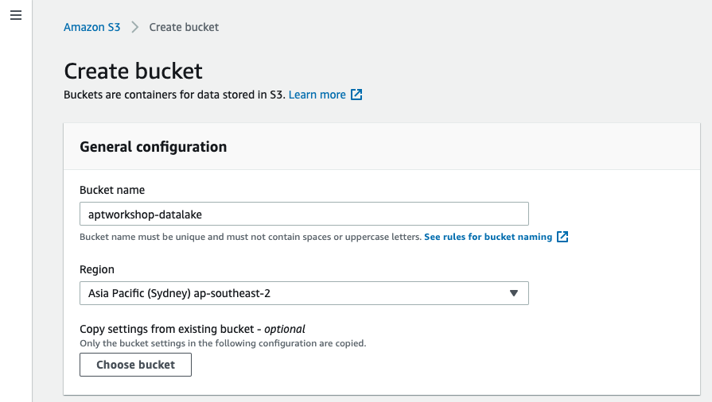
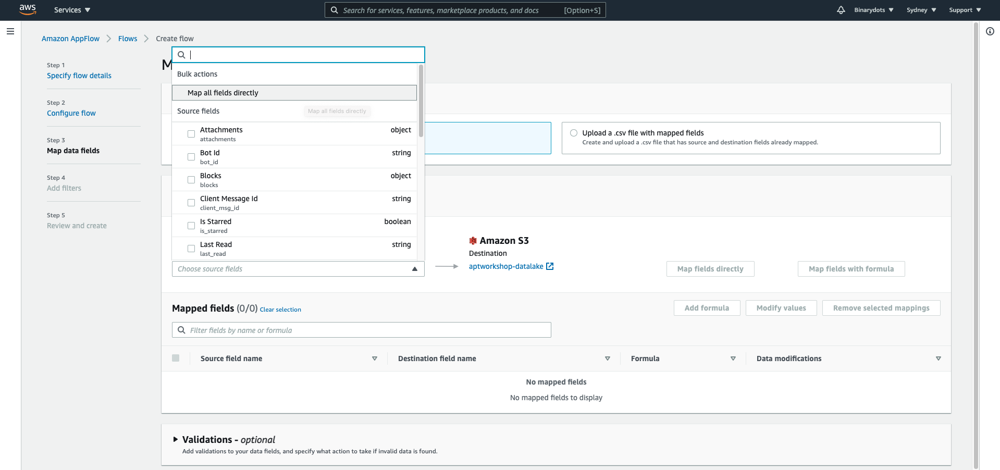

# AWS Appflow, Athena and Quicksight in Action - Workshop

## Introduction to AWS Appflow, Athena and Quicksight

*   Amazon AppFlow is a fully managed integration service that helps to transfer data between Software-as-a-Service (SaaS) applications like Salesforce, Marketo, Slack, and ServiceNow, and AWS services like Amazon S3 and Amazon Redshift, in just a few clicks.
*   Amazon Athena is the Amazon Web Services (AWS) service that allows to directly query files stored in S3 using SQL.
*   Amazon Quicksight is an AWS dashboarding service. It has a user-friendly drag and drop interface to create charts and full dashboards in less than an hour.

## Requirements

### AWS Account

In order to complete this workshop, you’ll need access to an AWS account. Your access needs to have sufficient permissions to create resources in Appflow, Athena, S3 and Quicksight. If you currently don’t have an AWS account, you can create one [here](https://aws.amazon.com/premiumsupport/knowledge-center/create-and-activate-aws-account)

### Slack Account

You'll need a slack account and a workspace to install the Slack app that we are creating as part of this workshop. You may not have Slack app install permissions for a workspace that you have joined unless the administrator has turned on the permissions.

If you do not have a Slack workspace, create a new workspace following instructions [here](https://slack.com/intl/en-au/help/articles/206845317-Create-a-Slack-workspace)

## Architecture

In this workshop, you will be integrating Slack with Amazon Appflow and transferring data from Slack to Amazon S3.  In the next stage of workshop, you will create Amazon Athena table and query the data using SQL.  In the final stage of the workshop, you will be creating charts in Amazon Quicksight using Amazon Athena as a source for dataset.


In Amazon Quicksight you will be analysing messages that are posted to Slack #general channel. You will mockup messages so that the messages will look like CI/CD pipeline deployment notifications.

## Preliminary Setup

In this workshop, you will be using Amazon S3 buckets for below purposes:

*   Datalake for storing Slack data
*   Saving query results from Athena (This is a pre-requisite for using Athena)

These S3 buckets must be created prior to starting the workshop.  

### Create S3 Bucket for storing slack data



You can leave all the fields as default and add some tags as best practice. Select region as Sydney and remember to use the same region across all other resources in this workshop.

### Create S3 Bucket for saving Athena query results 


You can leave all the fields as default and add some tags as best practice. Select region as Sydney and remember to use the same region across all other resources in this workshop.

Note:  This is optional step. This bucket needs to be configured in Athena (under Settings) if you are accessing Athena for the first time.


### Verify the new S3 buckets


Once these S3 buckets are created, you are ready to start the workshop.

Note :  In addition to the above two S3 buckets, as part of this workshop when you create a dataset using Athena, Amazon QuickSight creates another S3 bucket. By default, this bucket has a name similar to "aws-athena-query-results-<ACCOUNTID>-<REGION>". 

## Create and Install Slack App

In this step, you will create a slack app by following below instuctions:

*   Sign in to your Slack workspace where you’d like to install the new app, or \[create a new workspace\](https://slack.com/intl/en-au/help/articles/206845317-Create-a-Slack-workspace. Name the workspace as 'apt-workshop-workspace'.
*   Create a Slack app named 'APTWorkshopApp' from [here](https://api.slack.com/docs/sign-in-with-slack#sign-in-with-slack__details__create-your-slack-app-if-you-havent-already)


*   Select the workspace where you want to install the app.
*   After you create the app, in the navigation pane, under Features, choose OAuth & Permissions.
*   For Redirect URLs, enter ap-southeast-2.console.aws.amazon.com/appflow/oauth and save.


*   Set the following user token scopes:
    *   channels:history
    *   channels:read
    *   groups:history
    *   groups:read
    *   im:history
    *   im:read
    *   mpim:history
    *   mpim:read


*   Note your client ID, client secret, and Slack instance name. Client ID and Client secret can be found under 'App Credentials' section.  
    Slack instance name is the workspace name


*   Install the new app to workspace from 'Install App' under settings. Click 'Allow' for the access permission notification during the installation.


*   In the last stage of the workshop, you will be analysing the Slack messages with Amazon Quicksight.   Inorder to mock usecase (CI/CD deployment notification messages), post below messages in Slack workspace #general channel. 

```
Deploy to Staging*** succeeded
Deploy to Production succeeded
Deploy to Staging*** failed
Deploy to Staging*** succeeded
Deploy to Production succeeded
```
Note: As the format of the messages to be consistent, copy paste the messages to the channel.

## Connect Slack to Appflow and Create the flow

*   Open the Amazon AppFlow console [here](https://console.aws.amazon.com/appflow/)
*   Choose **Create flow** named 'APTWorkshopAppflow'
*   For **Flow details**, enter a name and description for the flow. Leave other fields as default.
*   Choose **Next**.
*   Choose **Slack** from the **Source name** dropdown list.
*   Choose **Connect** to open the **Connect to Slack**  box.
*   Under **Client ID**, enter your Slack client ID.
*   Under **Client secret**, enter your Slack client secret.
*   Under **Workspace**, enter the name of your Slack instance
*   Under **Connection name**, specify a name for your connection.
*   Choose **Continue**.
*   You will be redirected to the Slack login page. When prompted, grant Amazon AppFlow permissions to access your Slack account.


*   In the next screen, configure source (Slack) and destination (Amazon S3)
*   Select the S3 bucket from the list.  Note : This bucket was created in the premilinary step.
*   Leave the Flow Trigger option as 'run on demand'


*   In the next screen, select 'All map all fields directly' from 'Source field name' dropdown under '**Source to destination field mapping'**



*   Skip the Filters selection in the next screen and click 'Next'
*   Click 'Create flow' in the 'Review and Create' screen
*   This will create a new flow connecting Slack and S3


## Run the Appflow

*   Click on 'Run flow' to run the appflow you just created
*   Once the flow is executed succesfully, data can be viewed from the S3 URL given in the notification window.


Note: You can explore the data using Amazon Athena in the next section of the workshop

## Create Athena Table

*   Open the Amazon Athena console [here](https://console.aws.amazon.com/athena/)
*   Click on 'Create Table' and select 'From S3 Bucket'


*   In the next screen, choose a new database name and a table name
*   Type the S3 bucket name that you created in preliminary step


*   In Step 2, select JSON as the data format
*   In Step 3, add user, text and ts fields manually (In a real world use case, you can create the table using Amazon Glue to avoid the manual mapping of fields)


*   In Step 4, skip the partition setup and click on 'Create Table'

## Query Data in S3

*   In the Athena console, query the new table with below SQL to view the contents of the table

```sql
SELECT * FROM SLACK_DATA;
```


*   Create a new table called 'SLACK\_DATA\_ANALYSIS' by running below query. This table will be used for Amazon Quicksight analysis

```sql
CREATE TABLE IF NOT EXISTS SLACK_DATA_ANALYSIS
  AS
SELECT
  user,substr(text,11,10) as environment, substr(text,22,9) as status, ts
FROM
  SLACK_DATA
WHERE
  text like '%Deploy%';
```
This query will create a new table slack_data_analysis with new fields (evnironment, status) derived from the slack messages.

*   Run a select query to view the contents of this new table


*   In the last stage of the workshop,  you will analyse the data in table SLACK\_DATA\_ANALYSIS and create Amazon Quicksight charts.

## Create Amazon Quicksight Charts

### Setting up your QuickSight 

*   Open QuickSight from [here](https://quicksight.aws.amazon.com/).  For first time users, you will be prompted to signup for Quicksight.   Your AWS account number is displayed for verification purposes.
*   Choose to **Sign up for QuickSight**.
*   Choose **Standard.** To confirm, choose **Continue**.
*   Enter a unique account name for QuickSight
*   Enter a notification Email address
*   Choose the AWS Region (ap-southeast-2)
*   Review the choices you made, then choose **Finish**.
*   To open QuickSight, choose **Go to QuickSight**.
*   Click on Account icon on top right corner
*   Select 'Manage Quicksight'
*   Select 'Security & Permissions'
*   Click on 'Add or Remove' under Quicksight access to AWS Services


*   Check 'Amazon S3' and when prompted, check the buckets we created for AppFlow & Athena query results. Remember to tick write permission to Athena group.


*   Check 'Athena' box


## Create a dataset using Athena Datasource

*   On the Amazon QuickSight start page, choose Manage data.
*   On the Datasets page, choose New data set.
*   The Create a Data Set page displays.
*   In the FROM NEW DATA SOURCES section, choose the Athena data source card.
*   For Data source name, enter a descriptive name.
*   For Athena workgroup, choose primary workgroup (default).
*   Choose Validate connection to test the connection.
*   Choose Create data source.
*   In the Choose your table screen, select the Athena database and table.


*   In the finish dataset creation screen, select 'Import to SPICE for quicker analytics'
*   Click on 'Visualise'
*   This will take you to Quicksight Analysis section where upon completion of data import you can view the status as 'completed'


## Create Quicksight Charts

*   On the Amazon QuickSight analysis page, choose visual type as 'Vertical bar chart'
*   For X Axis, select 'ts' , For Value, use 'status' and for Group use 'Environment'
*   This will produce a chart that shows 'Deployment Frequency by Environment' 


## Cleanup

At the end of every workshop, you may wish to clean up following resources you have created so you do not incur additional costs.

*   S3 Buckets
*   AppFlow flows
*   Athena database and tables
*   Quicksight Datasets, Analyses and Charts

# Contributors

- Abdul Jaleel
- Paul Kukiel

# References

- [Connect Slack to Appflow](https://docs.aws.amazon.com/appflow/latest/userguide/slack.html)
- [AppFlow Getting Started](https://docs.aws.amazon.com/appflow/latest/userguide/getting-started.html)
- [Amazon Athena – Interactive SQL Queries for Data in Amazon S3](https://aws.amazon.com/blogs/aws/amazon-athena-interactive-sql-queries-for-data-in-amazon-s3)
- [Amazon Quicksight Userguide](https://docs.aws.amazon.com/quicksight/latest/user/welcome.html)
