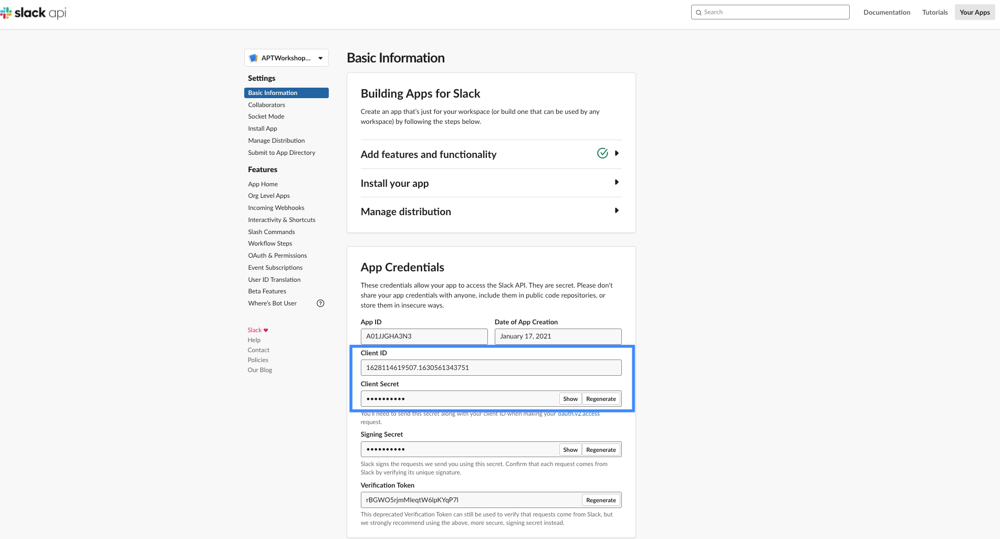

# AWS Appflow, Athena and Quicksight in Action - Workshop

## Introduction to AWS Appflow, Athena and Quicksight

*   Amazon AppFlow is a fully managed integration service that helps to transfer data between Software-as-a-Service (SaaS) applications like Salesforce, Marketo, Slack, and ServiceNow, and AWS services like Amazon S3 and Amazon Redshift, in just a few clicks.
*   Amazon Athena is the Amazon Web Services (AWS) service that allows to directly query files stored in S3 using SQL.
*   Amazon Quicksight is an AWS dashboarding service. It has a user-friendly drag and drop interface to create charts and full dashboards in less than an hour.

## Requirements

### AWS Account

In order to complete this workshop, you’ll need access to an AWS account. Your access needs to have sufficient permissions to create resources in Appflow, Athena, S3 and Quicksight. If you currently don’t have an AWS account, you can create one [here](https://aws.amazon.com/premiumsupport/knowledge-center/create-and-activate-aws-account)

### Slack Account

You'll need a slack account and a workspace to install the Slack app that we are creating as part of this workshop. You may not have Slack app install permissions for a workspace that you have joined unless the administrator has turned on the permissions. You can create a workspace which has permission to install a Slack app. 

If you do not have a Slack workspace, create a new workspace following instructions [here](https://slack.com/intl/en-au/help/articles/206845317-Create-a-Slack-workspace)

## Architecture

In this workshop, you will be integrating Slack with Amazon Appflow and transferring data from Slack to S3 bucket.  In the next stage, create Amazon Athena table and query the data using SQL.  In the final stage of the workshop, you will be creating charts in Amazon Quicksight using Amazon Athena as a source for dataset.

## Preliminary Setup

In the workshop, you will be using Amazon S3 bucket for below purposes:

*   Datalake for storing Slack data.
*   Saving query results from Athena (This is a pre-requisite for using Athena)

These S3 buckets must be created prior to starting the workshop.  

### Create S3 Bucket for storing slack data

You can leave all the fields as default and add some tags as best practice. Select region as Sydney and remember to use the same region across all other resources in this workshop.

### Create S3 Bucket for saving Athena query results

You can leave all the fields as default and add some tags as best practice. Select region as Sydney and remember to use the same region across all other resources in this workshop.

### Verify the new S3 buckets

Once these S3 buckets are created, you are ready to start the workshop.

## Create and Install Slack App

In this step, you will create a slack app by following below instuctions:

*   Sign in to your Slack workspace where you’d like to install the new app, or \[create a new workspace\](https://slack.com/intl/en-au/help/articles/206845317-Create-a-Slack-workspace. Name the workspace as 'apt-workshop-workspace'.
*   Create a Slack app named 'APTWorkshopApp' from [here](https://api.slack.com/docs/sign-in-with-slack#sign-in-with-slack__details__create-your-slack-app-if-you-havent-already)

*   Select the workspace where you want to install the app.
*   After you create the app, in the navigation pane, under Features, choose OAuth & Permissions.
*   For Redirect URLs, enter ap-southeast-2.console.aws.amazon.com/appflow/oauth and save.

*   Set the following user token scopes:
    *   channels:history
    *   channels:read
    *   groups:history
    *   groups:read
    *   im:history
    *   im:read
    *   mpim:history
    *   mpim:read

*   Note your client ID, client secret, and Slack instance name. Client ID and Client secret can be found under 'App Credentials' section.  
    Slack instance name is the workspace name

*   Install the new app to workspace from 'Install App' under settings. Click 'Allow' for the access permission notification during the installation.

## Connect Slack to Appflow and Create the flow

*   Open the Amazon AppFlow console at
*   Choose **Create flow** named 'APTWorkshopAppflow'
*   For **Flow details**, enter a name and description for the flow. Leave other fields as default.
*   Choose **Next**.
*   Choose **Slack** from the **Source name** dropdown list.
*   Choose **Connect** to open the **Connect to Slack**  box.
*   Under **Client ID**, enter your Slack client ID.
*   Under **Client secret**, enter your Slack client secret.
*   Under **Workspace**, enter the name of your Slack instance
*   Under **Connection name**, specify a name for your connection.
*   Choose **Continue**.
*   You will be redirected to the Slack login page. When prompted, grant Amazon AppFlow permissions to access your Slack account.

*   In the next screen, configure source (Slack) and destination (Amazon S3)
*   Select the S3 bucket 'aptworkshop-datalake' from the list.  This bucket was created in the premilinary step.
*   Leave the Flow Trigger option as 'run on demand'
*   In the next screen, select 'All map all fields directly' from 'Source field name' dropdown under '**Source to destination field mapping'**
*   Skip the Filters selection in the next screen and click 'Next'
*   Click 'Create flow' in the 'Review and Create' screen
*   This will create the flow named ' 'APTWorkshopAppflow'

## Cleanup

At the end of every workshop, you may wish to clean up the stuff you have created so you do not incur additional costs.
